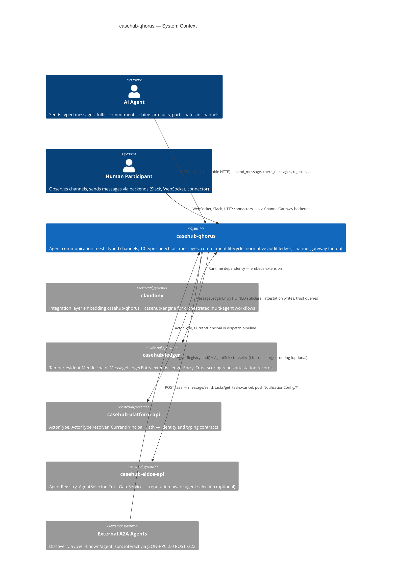
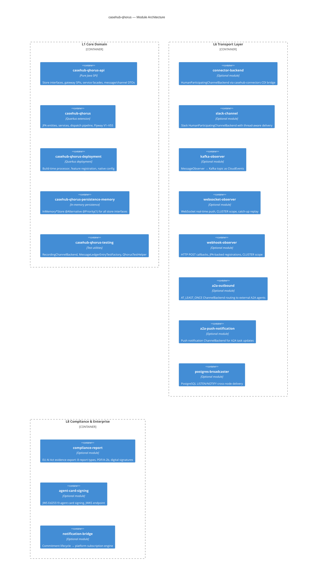
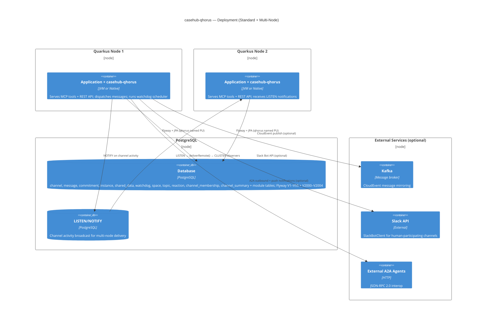

# CaseHub Qhorus — ARC42STORIES.MD

**Spec:** Arc42Stories v0.1
**Profile:** CaseHub — Foundation tier
**Profile ref:** `../parent/docs/arc42stories-casehub-profile.md` · fallback: `https://raw.githubusercontent.com/casehubio/parent/main/docs/arc42stories-casehub-profile.md`
**Build position:** Foundation — depends on `casehub-platform-api` and `casehub-ledger`; no other casehubio dependencies
**Consumed by:** `claudony` (integration layer)
**Depends on:** `casehub-platform-api` (compile, `api/` module), `casehub-ledger` (compile, runtime + optional modules)

---

## §1 Introduction and Goals

### Description

Qhorus is a Quarkus-based agent communication mesh and the peer-to-peer coordination layer for multi-agent AI systems. More precisely, it is a governance methodology — not middleware. It gives every agent interaction the formal status of an accountable act, grounded in speech act theory, deontic logic, defeasible reasoning, and social commitment semantics. The LLM reasons; the infrastructure enforces, records, and derives.

Any Quarkus app adds `io.casehub:casehub-qhorus` as a dependency and its agents get: typed channels with declared update semantics (APPEND, COLLECT, BARRIER, EPHEMERAL, LAST_WRITE); typed messages via a 10-type speech-act taxonomy (QUERY, COMMAND, RESPONSE, STATUS, DECLINE, HANDOFF, DONE, FAILURE, PROPOSE, EVENT); a shared data store with artefact lifecycle management; an instance registry with capability tags and three addressing modes; commitment-tracked obligation lifecycle; normative audit via a tamper-evident Merkle ledger; and channel gateway fan-out across pluggable transport backends.

Qhorus has no dependency on CaseHub or Claudony — it is the independent communication layer.

### Stakeholders

| Stakeholder | Interest |
|---|---|
| Quarkus app developer | Embeds the extension; configures `casehub.qhorus.*` properties; wires CDI beans; implements backend SPIs |
| Consumer repo (claudony) | Integrates qhorus as the agent mesh layer; combines with casehub-engine for orchestration |
| AI agent | Sends and receives typed messages; fulfils commitments; claims artefacts; participates in channels |
| A2A ecosystem | Discovers agents via `/.well-known/agent.json`; interacts via JSON-RPC 2.0 at `POST /a2a` |
| Platform team | Maintains speech-act contracts, SPI stability, ledger integrity, and cross-repo protocol compliance |

### Quality Goals

| Priority | Goal | Scenario |
|---|---|---|
| 1 | Commitment lifecycle correctness | A COMMAND dispatched to a channel opens an obligation that is fulfilled, declined, or expired within one scheduler cycle — no silent drops |
| 2 | Isolation | The core extension compiles and passes unit tests without `casehub-engine`, `claudony`, or any application-tier repo on the classpath |
| 3 | Zero-datasource unit testing | `MessageServiceTest` runs without Quarkus boot via `InMemoryMessageStore`, completing in under 1 s |

### Artifact Schema

| Artifact type | Format | Example | Where it lives |
|---|---|---|---|
| Issue | `#NNN` or `casehubio/qhorus#NNN` | `#456` | GitHub Issues |
| ADR | `ADR-NNNN` | `ADR-0005` | `docs/adr/` |
| Garden entry | `GE-YYYYMMDD-XXXXXX` | `GE-20260618-d81cef` | `~/.hortora/garden/` |
| Protocol | `PP-YYYYMMDD-XXXXXX` | `PP-20260608-054090` | `docs/protocols/casehub/` |
| Design spec | `YYYY-MM-DD-topic-design` | `2026-04-13-qhorus-design` | `docs/specs/` |

---

## §2 Constraints

### Platform

| Constraint | Value |
|---|---|
| Java | 21 language level, running on JVM 26 |
| Framework | Quarkus 3.32.2 |
| MCP transport | `quarkus-mcp-server-http` 1.11.1 (Streamable HTTP, MCP spec 2025-06-18) |
| Native target | GraalVM 25 |
| Build | `JAVA_HOME=$(/usr/libexec/java_home -v 26) mvn clean install` — use `mvn`, not `./mvnw` |

### Architectural Constraints

- Named 'qhorus' datasource: all JPA entities and Flyway migrations use a dedicated named persistence unit, isolating qhorus schema from other extensions on the same classpath
- Flyway path scoping: all migrations at `classpath:db/qhorus/migration/`; domain tables V1–V55; ledger subclass join at V2000+
- Config prefix: `casehub.qhorus.*` (not `quarkus.qhorus`)
- Zero casehubio core deps beyond `casehub-platform-api` and `casehub-ledger`: all other casehubio integrations are optional or in separate modules
- Module naming: short names (`api/`, `runtime/`, `deployment/`) — no repo-prefix repetition
- Test datasource: H2 `MODE=PostgreSQL` with `DB_CLOSE_DELAY=-1`; both default and qhorus named PUs require `database.generation=drop-and-create`

---

## §3 Context and Scope

### Boundary Rules

What casehub-qhorus explicitly does NOT do:

- Orchestrate case flow or interpret case plan state — that is `casehub-engine`
- Provision or lifecycle-manage AI agents — that is `claudony`
- Implement trust scoring algorithms — that is `casehub-ledger` (qhorus writes attestations; ledger computes trust)
- Manage human task lifecycles (claim, SLA, escalation) — that is `casehub-work`
- Define agent capabilities or persona mappings — that is `casehub-eidos`

### Platform References

- `docs/platform/dependency-map.md` — authoritative consumer list
- `docs/repos/qhorus.md` — platform deep-dive for this module
- `docs/specs/2026-04-13-qhorus-design.md` — original design specification
- `docs/agent-protocol-comparison.md` — A2A vs ACP vs Qhorus
- `docs/multi-agent-framework-comparison.md` — full multi-agent framework comparison

---

## §4 Solution Strategy

Foundation modules define their own layer taxonomy. Qhorus's layers represent the internal architectural concerns added incrementally across 55 build chapters:

### Layer Taxonomy

| Layer | Concern |
|---|---|
| L1 Core Domain | Channel, Message, Instance, SharedData entities; CRUD services; store interfaces; 5 channel semantics (APPEND, COLLECT, BARRIER, EPHEMERAL, LAST_WRITE) |
| L2 Speech Act Protocol | 10-type message taxonomy (ADR-0005); commitment lifecycle (7 states: OPEN→ACKNOWLEDGED→FULFILLED/DECLINED/FAILED/DELEGATED/EXPIRED); correlation integrity; dispatch pipeline; ObligorTrustPolicy |
| L3 Normative Audit | MessageLedgerEntry (all 10 types); CommitmentAttestationPolicy SPI; EvidentialChecker (Zone 1–3); peer attestation; AttestorCredibilityPolicy; CausalGraphService |
| L4 Channel Features | Topics (create, merge, move); reactions (idempotent); spaces (recursive nesting); membership (join/leave, unread counts); presence (Caffeine-based heartbeat); channel summaries (SummaryUpdateHook SPI); projections (left-fold SPI); delivery tracking (per-participant) |
| L5 Enforcement & Safety | Watchdog framework (8 condition types); ChannelProtocol SPI (4 built-in protocols); enforcement modes (ADVISORY/BLOCKING/QUARANTINE); DispatchAdvisory pipeline; containment actions; channel policy overrides |
| L6 Transport Layer | ChannelGateway (backend-agnostic fan-out); backend impls (qhorus-internal, connector, Slack, A2A outbound, push notification); MessageObserver SPI (LOCAL/CLUSTER scope); observer impls (in-process CDI, Kafka, WebSocket, Webhook); DeliveryService (AT_LEAST_ONCE pump); postgres broadcaster (LISTEN/NOTIFY) |
| L7 API Surface | MCP tools (blocking); REST resources (channels, A2A JSON-RPC, agent cards, causal graphs, compliance); per-agent cards at `/.well-known/agents/{instanceId}.json` |
| L8 Compliance & Enterprise | Compliance report module (EU AI Act, 8 report types, PDF/A-2b + digital signatures); agent card signing (JWS Ed25519, JWKS endpoint); notification bridge (platform subscription engine); routing bridge (reputation-aware, role: targets); capacity signals |

### Chapter Sequencing Rationale

Hard dependencies — order is non-negotiable:

- L1 Core Domain before L2 Speech Act Protocol: commitment lifecycle requires channel + message entities
- L2 Speech Act Protocol before L3 Normative Audit: ledger entries record commitment state transitions
- L1 Core Domain before L6 Transport Layer: gateway fans out persisted messages
- L2 Speech Act Protocol before L5 Enforcement & Safety: protocol enforcement evaluates message types and commitment state
- L3 Normative Audit before L8 Compliance & Enterprise: compliance reports query ledger entries

---

## §5 Building Block View

### Module Index

| Folder | Artifact | Type | Purpose |
|---|---|---|---|
| `api/` | `casehub-qhorus-api` | Pure Java SPI | Store interfaces (6), gateway SPIs (ChannelBackend, MessageObserver, InboundNormaliser), service facades (ChannelManager, MessageDispatcher), message/channel DTOs, CommitmentAttestationPolicy SPI |
| `runtime/` | `casehub-qhorus` | Quarkus extension | JPA entities (Channel, Message, Commitment, Instance, SharedData, Watchdog, Space, Topic, Reaction, ChannelMembership, ChannelSummary), services, dispatch pipeline, ledger integration, Flyway V1–V55 |
| `deployment/` | `casehub-qhorus-deployment` | Quarkus deployment | Build-time processor, feature registration, native image migration resource registration |
| `persistence-memory/` | `casehub-qhorus-persistence-memory` | In-memory persistence | InMemory*Store implementations for all store interfaces — `@Alternative @Priority(1)` for zero-config test isolation |
| `testing/` | `casehub-qhorus-testing` | Test utilities | RecordingChannelBackend, MessageLedgerEntryTestFactory, QhorusTestHelper |
| `connector-backend/` | `casehub-qhorus-connector-backend` | Optional bridge module | Routes InboundMessage CDI events from casehub-connectors into qhorus channel dispatch; ConnectorNormaliser SPI |
| `slack-channel/` | `casehub-qhorus-slack-channel` | Optional backend | HumanParticipatingChannelBackend via SlackBotClient; thread-aware delivery with composite in-memory + DB-backed cache |
| `kafka-observer/` | `casehub-qhorus-kafka-observer` | Optional observer | MessageObserver → Kafka topic as CloudEvents (LOCAL scope) |
| `websocket-observer/` | `casehub-qhorus-websocket-observer` | Optional observer | WebSocket real-time push (CLUSTER scope); catch-up replay via lastEventId |
| `webhook-observer/` | `casehub-qhorus-webhook-observer` | Optional observer | HTTP POST callbacks (CLUSTER scope); JPA-backed registrations; CredentialResolver for signing secrets |
| `a2a-outbound/` | `casehub-qhorus-a2a-outbound` | Optional bridge | AT_LEAST_ONCE ChannelBackend routing channel messages to external A2A agents via delivery pump |
| `a2a-push-notification/` | `casehub-qhorus-a2a-push-notification` | Optional backend | Push notification ChannelBackend for A2A task status updates; per-URL health tracking with exponential backoff |
| `compliance-report/` | `casehub-qhorus-compliance-report` | Optional module | EU AI Act compliance evidence export — 8 report types; format renderers (JSON, CSV, HTML, PDF/A-2b); digital signatures (PAdES + CAdES); property verification; scheduled generation |
| `agent-card-signing/` | `casehub-qhorus-agent-card-signing` | Optional module | JWS Ed25519 agent card signing; JCS canonicalization; JWKS endpoint; identity-verification trust dimension |
| `notification-bridge/` | `casehub-qhorus-notification-bridge` | Optional bridge | Commitment lifecycle → platform subscription engine via QhorusObligationEvent (SubscribableEvent) |
| `postgres-broadcaster/` | `casehub-qhorus-postgres-broadcaster` | Optional module | PostgreSQL LISTEN/NOTIFY cross-node backend delivery; self-notification filtering |
| `a2a-protocol/` | `casehub-a2a-protocol` | Pure Java library | Layer 0 A2A types: AgentCard, JsonRpcRequest, A2ATask, A2AMessage, A2APart (sealed) |
| `examples/type-system/` | — | Test module | Fast regression tests for the 10-type taxonomy (CI, no LLM) |
| `examples/normative-layout/` | — | Test module | Deterministic 3-channel NormativeChannelLayout tests (CI, no LLM) |
| `examples/agent-communication/` | — | Test module | Real LLM agent examples (Jlama); normative benchmark (Zone 1/2/3); activate with `-Pwith-llm-examples` |

### API Interface Taxonomy

Four categories across `api/`:

| Category | Package | Purpose |
|---|---|---|
| Data access (CRUD) | `api/store/` | Blocking store interfaces; consumers implement via JPA |
| Extension points | `api/spi/` | Consumer-replaceable policies — CommitmentAttestationPolicy, ObligorTrustPolicy, AttestorCredibilityPolicy, InstanceActorIdProvider |
| Integration contracts | `api/gateway/` | Consumer-implemented backends — AgentChannelBackend, HumanParticipatingChannelBackend, HumanObserverChannelBackend, MessageObserver, InboundNormaliser |
| Service facades | `api/channel/`, `api/message/` | Consumer-called — ChannelManager, MessageDispatcher; read-only, no implementation needed |

---

## §6 Runtime View

### Scenario 1 — Message dispatch pipeline

Actor calls `send_message` (MCP tool) or `messageService.dispatch(MessageDispatch)`. The dispatch pipeline is the single enforcement gate for all channel writes:

1. **Paused check** — channel must not be paused
2. **AllowedWritersPolicy** — sender must be in the channel's write ACL (or ACL is null = open)
3. **RateLimiter** — in-memory 60-second sliding window (per-channel + per-instance)
4. **RoutingBridge** — resolves `role:X` capability targets to specific agent instanceIds via eidos `AgentRegistry.find()` + `AgentSelector.select()`
5. **ObligorTrustPolicy** — for COMMAND + named non-prefixed target, checks obligor trust meets threshold
6. **MessageTypePolicy** — hard-enforces COMMAND/QUERY on typed channels (allowedTypes/deniedTypes); advisory for other types
7. **CorrelationIntegrityChecker** — advisory checks on inReplyTo, resolution type matching, obligor identity, cross-channel resolution
8. **ProtocolRegistry** — evaluates all registered ChannelProtocol beans; produces `List<DispatchAdvisory>`
9. **EnforcementGate** — applies channel enforcement mode (ADVISORY/BLOCKING/QUARANTINE) to accumulated advisories; exempts EVENTs, system senders, and obligation-resolving types
10. **LAST_WRITE** — same-sender overwrite semantics
11. **Persist** — `messageStore.put()` + `topicService.ensureExists()`
12. **Commitment open** — for COMMAND/QUERY/PROPOSE with correlationId, opens an obligation
13. **FanOut** — `channelGateway.fanOut()` to all registered backends
14. **LedgerWriteService.record** — writes MessageLedgerEntry + attestation (REQUIRES_NEW)
15. **MessageObserverDispatcher** — fires registered MessageObserver beans (after commit via JTA synchronization)

### Scenario 2 — Commitment lifecycle

A COMMAND dispatched with a `correlationId` opens a `Commitment` in OPEN state. The obligor acknowledges (→ACKNOWLEDGED), then sends DONE (→FULFILLED) or FAILURE (→FAILED) or DECLINE (→DECLINED). HANDOFF delegates to another agent (→DELEGATED, child OPEN created). `CommitmentService.expireOverdue()` runs on schedule and transitions past-deadline commitments to EXPIRED. Each terminal transition triggers `LedgerWriteService.writeAttestation()` — one on the COMMAND entry (requester trust), one on the terminal entry (obligor trust).

### Scenario 3 — A2A task streaming

External client sends `POST /a2a` with `message/send` JSON-RPC method and `Accept: text/event-stream`. `A2AResource.dispatchStream()` maps A2A message to qhorus `send_message`, registers an SSE consumer via `A2AChannelBackend.registerStream()`, and streams task status updates as SSE events. `A2ATaskStateMapper` maps MessageType → A2A task state (DONE→"completed", FAILURE→"failed", DECLINE→"canceled", STATUS/HANDOFF→"working"). SSE keepalives every 15s; max duration 1800s; orphan detection on disconnect.

### Scenario 4 — Watchdog evaluation cycle

`WatchdogScheduler` fires on `@Scheduled` interval. For each registered Watchdog, `WatchdogEvaluationService.evaluateAll()` evaluates the condition type: BARRIER_STUCK, LOOP_DETECTED, OBLIGATION_FAN_OUT, CONVERSATION_STALL, ECHO_CHAMBER, CONTEXT_PRESSURE, DELIVERY_LAG, CIRCULAR_DELEGATION. When a condition fires, `executeContainmentAction()` runs the configured action (ALERT, PAUSE_CHANNEL, DEREGISTER_AGENT, QUARANTINE). Notification channel is excluded from pause to prevent self-defeat.

### Scenario 5 — Channel gateway fan-out

After `MessageService.dispatch()` persists a message, `ChannelGateway.fanOut()` iterates all registered backends for that channel. BEST_EFFORT backends receive the message synchronously via `post()`. AT_LEAST_ONCE backends are signaled via `DeliverySignalQueue`; `DeliveryService` pump thread picks up the signal and calls `DeliveryBatchExecutor.deliverBatch()`. Per-participant delivery retry runs after the backend catches up — `retryLaggingParticipants()` queries members with `lastDeliveredMessageId` < backend cursor and calls `deliverTo()` for missed messages.

---

## §7 Deployment View

### Deployment Variants

| Variant | Add to classpath | Capability gained |
|---|---|---|
| Minimal (evaluation) | `casehub-qhorus` + H2 datasource | Full channel/message/commitment lifecycle, MCP tools, agent card |
| Standard | `casehub-qhorus` + PostgreSQL datasource | Production datasource, Flyway migrations |
| Full audit | + `casehub-ledger` | Tamper-evident Merkle chain, attestation, trust scoring |
| Multi-node | + `casehub-qhorus-postgres-broadcaster` | All nodes receive all channel activity via LISTEN/NOTIFY |
| Human channels | + `casehub-qhorus-connector-backend` or `casehub-qhorus-slack-channel` | Human-in-the-loop messaging via connectors or Slack |
| Full platform | + all optional modules | A2A outbound, push notifications, Kafka/WebSocket/Webhook observers, compliance reports, agent card signing, notification bridge |

---

## §8 Crosscutting Concepts

### Convention References

| Concern | Protocol |
|---|---|
| Flyway path scoping | `qhorus-flyway-consumer-versioning` — all migrations at `db/qhorus/migration/`; consumers set Flyway location explicitly |
| CDI displacement | `@DefaultBean` displaced by `@Alternative @Priority(1)` via classpath presence |
| SPI placement | Consumer-facing SPIs in `api/spi/`; `@DefaultBean` impls in `runtime/` when JPA or config deps apply |
| Optional module JPA registration | `optional-module-jpa-package-registration` — consumer must append optional module packages to `quarkus.hibernate-orm.qhorus.packages` |
| Channel dual-identity resolution | `channel-dual-identity` — UUID or slug at the resource boundary; resolve once, pass UUID internally |
| System sender trust exemption | `system-sender-trust-exemption` — senders containing `:` bypass ObligorTrustPolicy |
| EVENT content invariant | `event-content-free-signal-type` — EVENT content is always null; telemetry goes in `dispatch.telemetry()` |
| Observer dispatch timing | `observer-test-transaction-discipline` — observers fire after commit via JTA `afterCompletion(STATUS_COMMITTED)` |
| Startup event isolation | `startup-event-handler-exception-isolation` — exception-isolated per channel in ChannelGateway startup recovery |
| Ledger sequence table init | `ledger-sequence-table-test-init` — test modules must include `import-qhorus-test.sql` for `ledger_subject_sequence` |
| Scheduled service tenancy | `scheduled-service-cross-tenant-stores` — background/scheduled services use `CrossTenant*Store` with `@QhorusSystem` principal |

### Anti-Patterns

**Symptom:** `MessageObserver.onMessage()` is never invoked in a `@TestTransaction` test, even though `messageService.dispatch()` succeeds and the message is persisted.
**Cause:** `MessageObserverDispatcher` defers dispatch to `afterCompletion(STATUS_COMMITTED)` via JTA `TransactionSynchronizationRegistry`. In a `@TestTransaction` test the transaction rolls back, so `afterCompletion` fires with `STATUS_ROLLEDBACK` and observers are silently skipped.
**Fix:** Use `QuarkusTransaction.requiringNew().run(() -> messageService.dispatch(...))` instead of `@TestTransaction`. Entity setup must also be committed first in a separate `requiringNew()` block. See GE-20260608-038af4 and PP-20260608-07daa6.

**Symptom:** An `InMemoryChannelStore.put()` call in a `@QuarkusTest` causes Hibernate to flush an unexpected INSERT to the database, even though the store never calls any Panache method.
**Cause:** Hibernate's bytecode enhancement dirty-tracks all field writes on `PanacheEntity` subclasses within an active Panache session — even for entities that were never persisted or loaded. The InMemory store modifies entity fields (e.g. `channel.lastActivityAt`) inside `Panache.withSession()` scope, triggering a phantom dirty flush.
**Fix:** InMemory store implementations must not mutate PanacheEntity fields in-place within session scope. Methods like `updateLastActivity()` must be no-ops in InMemory implementations; `put()` sets creation-time defaults sufficient for test contexts. See PP-20260618-100368, GE-20260618-d81cef.

**Symptom:** `CommitmentAttestationPolicy.attestationFor()` returns a verdict based on stale OPEN commitment state, even though the commitment was just fulfilled in the same dispatch.
**Cause:** `LedgerWriteService.record()` runs in `REQUIRES_NEW` — the outer transaction's commitment update is not yet committed when the ledger write runs. Querying `CommitmentStore` inside the REQUIRES_NEW boundary sees the old OPEN state.
**Fix:** `LedgerWriteService` does NOT query `CommitmentStore` — attestation verdict is derived from `MessageType` directly via `CommitmentAttestationPolicy`. The CommitmentStore query would see stale state. Integration tests for attestation must use `helper.sendMessage()` (not `messageService.dispatch()` directly).

**Symptom:** `@QuarkusTest` in a module that enables `casehub.ledger.enabled=true` fails at startup with `Table "LEDGER_SUBJECT_SEQUENCE" not found`.
**Cause:** `ledger_subject_sequence` is NOT a JPA entity — Hibernate `drop-and-create` does not create it. The table is needed by `QhorusSequenceAllocator` for atomic sequence allocation.
**Fix:** All test modules that enable the ledger must include `import-qhorus-test.sql` (one `CREATE TABLE IF NOT EXISTS ledger_subject_sequence ...` statement) and set `quarkus.hibernate-orm.qhorus.sql-load-script=import-qhorus-test.sql`.

---

## §9 Journeys and Chapters

### §9.1 Journey Overview

| Journey | Description | Chapters | Status |
|---|---|---|---|
| J1 — Core Communication Mesh | Foundational mesh: entities, MCP tools, channel semantics, correlation, artefacts, addressing, agent card, A2A, HITL, ACL, ledger, persistence abstraction, reactive dual-stack | C1–C14 | ✅ Complete |
| J2 — Normative Governance | Commitment lifecycle, speech act taxonomy, normative audit ledger, commitment attestation, evidential checking, multi-tenancy | C15–C20 | ✅ Complete |
| J3 — Channel Gateway & Transport | Backend-agnostic fan-out, connector/Slack backends, MessageObserver SPI, Kafka/WebSocket/Webhook observers, delivery service, postgres broadcaster | C21–C27 | ✅ Complete |
| J4 — Channel Intelligence | Topics, reactions, artefact references, channel membership, spaces, presence, channel summaries, projections, delivery tracking, chunked uploads | C28–C37 | ✅ Complete |
| J5 — Operational Safety | Watchdog framework, coordination pathology conditions, context pressure, protocol enforcement SPI, enforcement modes, watchdog containment actions | C38–C44 | ✅ Complete |
| J6 — Trust, Compliance & Routing | Peer attestation, attestor credibility, causal graphs, PROPOSE message type, reputation-aware routing, compliance reports, agent card signing, A2A outbound, push notifications, notification bridge, channel policy overrides | C45–C55 | ✅ Complete |

### §9.2 Chapter Index

| # | Chapter | Journey | Key issues | Status |
|---|---|---|---|---|
| C1 | Core Data Model + Services | J1 | Phase 1 | ✅ |
| C2 | MCP Tool Surface | J1 | Phase 2 | ✅ |
| C3 | Channel Semantics | J1 | Phase 3 | ✅ |
| C4 | Correlation + wait_for_reply | J1 | Phase 4 | ✅ |
| C5 | Artefacts | J1 | Phase 5 | ✅ |
| C6 | Addressing | J1 | Phase 6 | ✅ |
| C7 | Agent Card | J1 | Phase 7 | ✅ |
| C8 | A2A Compatibility | J1 | Phase 9 | ✅ |
| C9 | Human-in-the-Loop Controls | J1 | Phase 10 | ✅ |
| C10 | Access Control + Governance | J1 | Phase 11 | ✅ |
| C11 | Structured Observability | J1 | Phase 12 | ✅ |
| C12 | Persistence Abstraction | J1 | Phase 13, ADR-0002 | ✅ |
| C13 | Reactive Dual-Stack | J1 | Phase 14, #74–#80, ADR-0003 | ✅ |
| C14 | Documentation | J1 | Phase 15, #81 | ✅ |
| C15 | Commitment Lifecycle | J2 | #121 | ✅ |
| C16 | Speech Act Taxonomy | J2 | ADR-0005 | ✅ |
| C17 | Normative Audit Ledger | J2 | #123, #179 | ✅ |
| C18 | Commitment Attestation SPI | J2 | #123, #304 | ✅ |
| C19 | Evidential Checker | J2 | #303 | ✅ |
| C20 | Multi-Tenancy | J2 | #260, #265 | ✅ |
| C21 | Channel Gateway | J3 | #135 | ✅ |
| C22 | Connector Backend | J3 | #216 | ✅ |
| C23 | Slack Channel Backend | J3 | #261 | ✅ |
| C24 | MessageObserver SPI | J3 | #163 | ✅ |
| C25 | Transport Observers | J3 | #279, #294 | ✅ |
| C26 | Delivery Service | J3 | #380 | ✅ |
| C27 | Postgres Broadcaster | J3 | — | ✅ |
| C28 | Topics | J4 | #329, #335, #336 | ✅ |
| C29 | Reactions | J4 | #330 | ✅ |
| C30 | Artefact References | J4 | #331 | ✅ |
| C31 | Channel Membership | J4 | #332, #379 | ✅ |
| C32 | Spaces | J4 | #334 | ✅ |
| C33 | Presence | J4 | #333 | ✅ |
| C34 | Channel Summaries | J4 | #355 | ✅ |
| C35 | Channel Projections | J4 | #232 | ✅ |
| C36 | Delivery Tracking | J4 | #376, #380 | ✅ |
| C37 | Chunked Artefact Upload | J4 | — | ✅ |
| C38 | Watchdog Framework | J5 | — | ✅ |
| C39 | Coordination Pathology Watchdogs | J5 | #354 | ✅ |
| C40 | Context Pressure + Delivery Lag | J5 | #363, #381 | ✅ |
| C41 | Circular Delegation Watchdog | J5 | #368 | ✅ |
| C42 | Protocol Enforcement SPI | J5 | #357 | ✅ |
| C43 | Enforcement Modes | J5 | #400 | ✅ |
| C44 | Watchdog Containment Actions | J5 | #399 | ✅ |
| C45 | Peer Attestation | J6 | #356 | ✅ |
| C46 | Attestor Credibility | J6 | #371 | ✅ |
| C47 | Causal Graph Service | J6 | #398 | ✅ |
| C48 | PROPOSE Message Type | J6 | #395 | ✅ |
| C49 | Reputation-Aware Routing | J6 | #401 | ✅ |
| C50 | Compliance Reports | J6 | #411, #414, #417, #418 | ✅ |
| C51 | Agent Card Signing | J6 | #403 | ✅ |
| C52 | A2A Outbound + Push Notifications | J6 | #396, #406 | ✅ |
| C53 | Notification Bridge | J6 | #375 | ✅ |
| C54 | Capacity Signals | J6 | #434 | ✅ |
| C55 | Channel Policy Overrides | J6 | #455 | ✅ |

<!-- Chapter entries for §9.3–§9.8 will be added per journey -->
